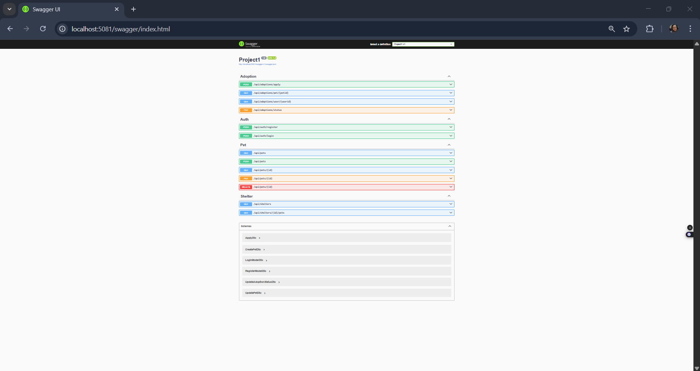
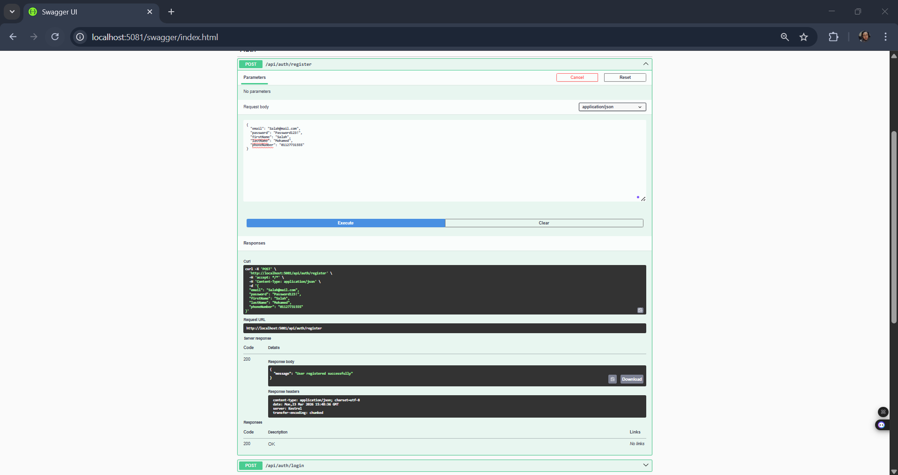
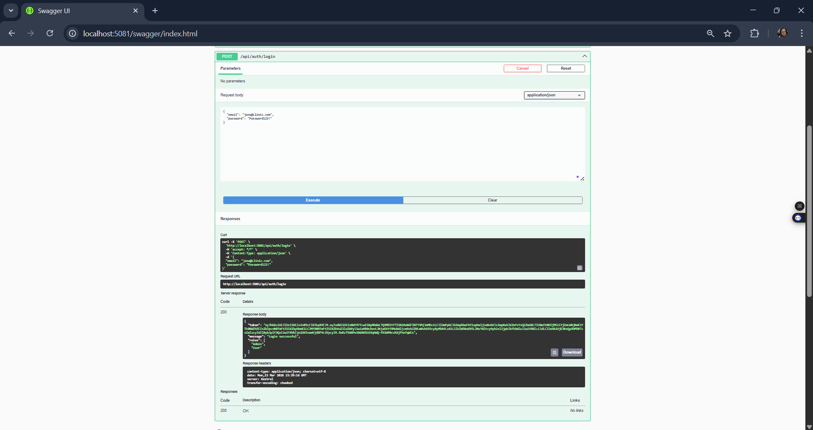
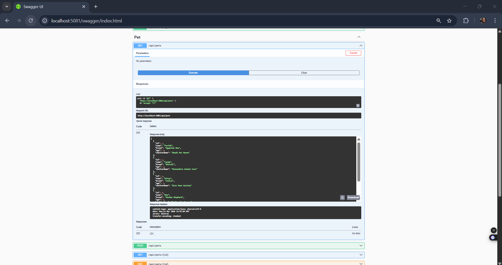
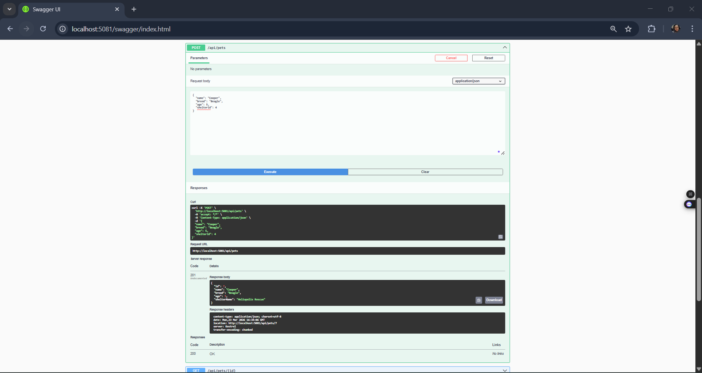
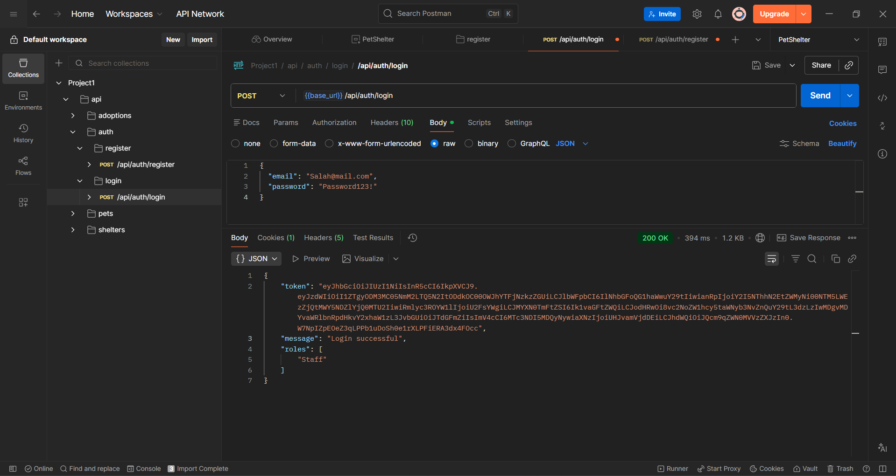

# Pet Shelter Management System API

This is an ASP.NET Core Web API for managing a pet shelter system, built as part of the Web Engineering course assignment. The system allows users to manage pets, shelters, and adoptions with JWT authentication and role-based authorization.

## Technologies Used

- **ASP.NET Core 10.0**: Framework for building the Web API with MVC pattern.
- **Entity Framework Core 10.0.4**: ORM for database operations with PostgreSQL using a Code-First approach.
- **Npgsql.EntityFrameworkCore.PostgreSQL 10.0.1**: PostgreSQL provider for EF Core.
- **Microsoft.AspNetCore.Identity.EntityFrameworkCore 10.0.4**: Identity framework for user management and authentication.
- **Microsoft.AspNetCore.Authentication.JwtBearer 10.0.0**: JWT token authentication middleware.
- **System.IdentityModel.Tokens.Jwt 8.6.1**: Library for JWT token generation and handling.
- **Microsoft.IdentityModel.Tokens 8.6.1**: Library for token validation and security keys.
- **Swashbuckle.AspNetCore 6.6.2**: Swagger/OpenAPI documentation for interactive testing.
- **Hangfire.AspNetCore 1.8.12** and **Hangfire.PostgreSql 1.20.8**: Background job scheduling for automated maintenance (bonus feature).

## Features

- **Secure Identity**: User registration and login with JWT authentication.
- **Role-Based Authorization**: Protected endpoints restricted to Admin, Staff, and User roles.
- **CRUD Operations**: Full management for pets, shelters, and adoption applications.
- **LINQ Optimization**: High-performance data retrieval using projections (`.Select()`) and `.AsNoTracking()`.
- **DTO Validation**: Strict input integrity enforced with DataAnnotations (Required, Range, EmailAddress).
- **Entity Relationships**: 
  - One-to-One: Pet linked to a specific PetProfile.
  - One-to-Many: Shelter containing multiple Pets.
  - Many-to-Many: Pets linked to multiple Users via AdoptionApplications.
- **Background Jobs**: Scheduled tasks using Hangfire to clean old records or generate reports.
- **Swagger UI**: Interactive API documentation for easy exploration of all endpoints.

## Running the Project

### Prerequisites
- **.NET 10.0 SDK**: Download from [Microsoft's official site](https://dotnet.microsoft.com/download/dotnet/10.0)
- **PostgreSQL Database**: Install PostgreSQL or use Docker
  - Via Docker: `docker run --name postgres-db -e POSTGRES_PASSWORD=yourpassword -e POSTGRES_DB=PetShelterDb -p 5432:5432 -d postgres:15`
- **Visual Studio 2022** or **VS Code** with C# extension

### Setup Instructions
1. **Clone the repository** and navigate to the project directory
2. **Install dependencies**: Run `dotnet restore`
3. **Database Setup**:
   - Ensure PostgreSQL is running on port 5432
   - Update `appsettings.json` with your database connection string:
     ```json
     "ConnectionStrings": {
       "DefaultConnection": "Host=localhost;Port=5432;Database=PetShelterDb;Username=postgres;Password=yourpassword"
     }
     ```
   - Update JWT configuration in `appsettings.json`:
     ```json
     "Jwt": {
       "Key": "YourSecureKeyAtLeast32CharactersLong!!!",
       "Issuer": "PetShelterAPI",
       "Audience": "PetShelterUsers"
     }
     ```
4. **Apply migrations**: Run `dotnet ef database update`
5. **Run the application**: Execute `dotnet run`
6. **Access the API**:
   - Swagger UI: `https://localhost:5081/swagger`
   - Hangfire Dashboard (Development): `https://localhost:5081/hangfire`

### Initial Setup (First Time)
After running migrations, create initial roles and admin user:
```bash
# The application will automatically create roles on startup
# Register an admin user via POST /api/auth/register, then manually assign Admin role in database
```

## API Endpoints

### Authentication
- `POST /api/auth/register` - Register a new user account.
- `POST /api/auth/login` - Login to receive a secure JWT token.

### Pets (Requires authentication)
- `GET /api/pets` - Get all pets.
- `GET /api/pets/{id}` - Get pet by ID.
- `POST /api/pets` - Create a new pet (Admin, Staff roles required).
- `PUT /api/pets/{id}` - Update a pet (Admin, Staff roles required).
- `DELETE /api/pets/{id}` - Delete a pet (Admin role required).

### Shelters (Requires authentication)
- `GET /api/shelters` - Get all shelters.
- `GET /api/shelters/{id}/pets` - Get all pets in a specific shelter.

### Adoptions (Requires authentication)
- `POST /api/adoptions/apply` - Submit a new adoption application.
- `GET /api/adoptions/pet/{petId}` - Get all applications for a specific pet.
- `GET /api/adoptions/user/{userId}` - Get all applications submitted by a specific user.
- `PUT /api/adoptions/status` - Update the status of an application (Approved/Rejected).

## API Screenshots

### Swagger UI Overview

*Main Swagger interface showing all available endpoints*

### User Registration

*POST /api/auth/register endpoint with successful response*

### JWT Authentication

*POST /api/auth/login returning JWT token in HTTP-only cookie*

### Protected Endpoints

*GET /api/pets requiring authentication (Bearer token)*

### CRUD Operations

*POST /api/pets with DTO validation and role-based authorization*

### Postman Collection
(screenshots/postman-collection2.png)(screenshots/postman-collection3.png)
*Postman collection demonstrating all endpoints with test results*

**Note**: Screenshots should be taken after running the application and testing endpoints in Swagger UI or Postman. Place them in the `screenshots/` folder with the naming convention shown above.

## Why HTTP-Only Cookies are Used for Authentication

HTTP-only cookies are an industry standard for authentication security because they significantly mitigate the risk of cross-site scripting (XSS) attacks. By setting the `HttpOnly` flag to `true`, the browser prevents any client-side JavaScript from accessing the session cookie. This ensures that even if a malicious script is successfully injected into the application, it cannot programmatically steal the user's JWT token, as the cookie is only exposed to the server during secure HTTP requests.

## Database Migrations

Migrations are included in the `Migrations` folder. These files contain the history of the database schema mapping. Run `dotnet ef database update` to ensure your local database is up to date with the latest code changes.

## Testing the API

### Using Swagger UI
1. Start the application and navigate to `https://localhost:5081/swagger`
2. Register a new user via the Auth endpoints
3. Login to receive JWT token (automatically stored in HTTP-only cookie)
4. Test protected endpoints by clicking "Try it out" on any endpoint
5. Verify role-based restrictions (some endpoints require Admin/Staff roles)

### Using Postman
1. Import the provided Postman collection: `PetShelterAPI.json`
2. Set up environment variables for base URL and JWT token
3. Run the collection to test all endpoints systematically
4. Check test results for validation and authorization

### Sample Test Scenarios
- **Authentication Flow**: Register → Login → Access protected endpoint
- **CRUD Operations**: Create pet → Read pets → Update pet → Delete pet
- **Authorization**: Try accessing admin-only endpoints with user role
- **Validation**: Submit invalid data and verify 400 responses
- **Relationships**: Create shelter → Add pets → Submit adoption application

## Project Structure

```
Project1/
├── Controllers/          # API controllers (Auth, Pet, Shelter, Adoption)
├── Models/              # Entity models (Pet, Shelter, AdoptionApplication, etc.)
├── DTOs/                # Data Transfer Objects for requests/responses
├── Services/            # Business logic services with dependency injection
├── Interfaces/          # Service interfaces
├── Database/            # ApplicationDbContext configuration
├── Migrations/          # EF Core database migrations
├── screenshots/         # API documentation screenshots
├── appsettings.json     # Configuration (connection strings, JWT settings)
├── Program.cs           # Application startup and DI configuration
└── README.md            # This file
```

## AI Usage and Development Process

This project was developed with assistance from AI tools. For transparency and academic integrity, please refer to:

- **[AI_USAGE.md](AI_USAGE.md)** - Complete documentation of AI interactions, prompts used, and human oversight
- **[SCREENSHOT_GUIDE.md](SCREENSHOT_GUIDE.md)** - Instructions for capturing required screenshots
- **[SUBMISSION_CHECKLIST.md](SUBMISSION_CHECKLIST.md)** - Pre-submission verification checklist
- **Screenshots folder** - Contains visual evidence of AI-assisted development and API testing

## Submission Information

This project is submitted as part of the Web Engineering course (Week 7, 10 marks). The repository contains:

- ✅ Complete source code with all required features
- ✅ Database migrations for Entity Framework Core
- ✅ Comprehensive README with setup instructions
- ✅ API documentation with Swagger screenshots
- ✅ AI usage documentation for transparency
- ✅ All technologies documented with descriptions
- ✅ HTTP-only cookies security explanation

**Repository Link**: [Add your GitHub repository URL here]

**Note**: If submitting via Google Classroom, provide only the repository link, not a ZIP file.
